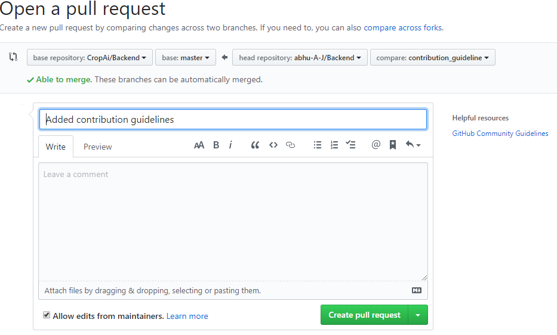

# Contributing Guidelines 👼🏽 👩🏽‍💻 👇🏽

We are extremely excited to have you onboard with our project. We hope to see some great contributions from your end and thank you all for making this project successful. 🤗

Before getting down to business, we believe to keep ourselves updated with the basics and so here are few extremely useful resources to get started with learning how to make contribution. Feel free to explore them :

- **[Git](https://git-scm.com/)** : is a free and open source distributed version control system designed to handle everything from small to very large projects with speed and efficiency.
- **[Github Guides](https://guides.github.com)** : Learn all about Github Flow, Git Commits, Making Pull Request, Forking Projects and more.

We love your input! We want to make contributing to this project as easy and transparent as possible, whether it's:

1. Reporting a bug
2. Discussing the current state of the code
3. Submitting a fix
4. Proposing new features
5. Becoming a maintainer

## We Develop with Github

  We use github to host code, to track issues and feature requests, as well as accept pull requests.


## Starting Steps to making history through your contributions

1. Start by forking our repository. Click on the button on the top right corner. This will bring the project to your Github Workspace:


2. You can now see the project on your own Github Account :


3. Now let's bring the forked project to your local machine so, you can start making some changes to it. So do so you can click the clone button (on the top corner - green  in color) and copy the URL. Go to your favorite terminal and hit the following command:
   ```sh
   git clone https://github.com/<your-username>/Backend.git
   ```
You can see your username in the < > section.

4. Move into the repository folder to see all the files present. To do so you have to move into the directory by typing the following command:
```sh
    cd Backend
```

It's that time when you need to create a new [remote](https://git-scm.com/book/en/v2/Git-Basics-Working-with-Remotes) (let's call it upstream) and link to the main repository so you can always keep your repository up-to-date

```sh
    git remote add upstream https://github.com/CropAi/Backend.git
```

## You're almost there 👏

5. It's always a good idea to keep you repository in sync with the main project. There are many ways to achieve this but we'll use the most simplest solution:
   > Technique where we fetch our upstream, merge the contents to our local repository's master and push the changes to our local origin's master. Sound's confusing?? Fear not, the git command comes to our rescue :

```sh
    git fetch upstream
    git checkout master
    git merge upstream/master
    git push origin master
```

## It's now time to show your magic

6. Always work by creating seperate feature branches, to do so you can run the following commands:
```sh
    git checkout -b "<branch-name>"
```
For example: `git checkout -b "bug-fix-2"`

The above command will make a new branch for you and move you to that branch.


6. Now it's time to show you almight strength in terms of code and make the changes to help improve the project. Go ahead! We believe in you. 🤩

7. Once all your changes are made, it's now time for us to see those changes as well. So now you need to commit you changes. As always the commands come for our rescue. You can hit:
```sh
    git add .
    git commit -m "<commit-message>"
    git push origin <branch-name>
```
For example if I was working on branch called `bug-fix-2` , the you can do the following:
```sh
    git add.
    git commit -m "Fixed  the bug on homepage"
    git push origin bug-fix-2
```

8. Now you can go to you Github account and Open a Pull Request. To do so click on compare and hit Pull Request Button on the top-right corner which pops up.


9. Make sure you get the green check mark saying "Able to merge". Write a message if the changes you made are very big to help us understand you changes better. 

**Always mention your issue number on you message using expressions like `closes` or `fixes`:**
> Example:  fixes #3
    



Finally hit create Pull Request Button.

Sit back and relax while we verify your changes. You finally did it. Congratulations! 🙌 🤝

Celebrate your success after your pull request is merged!


## Few other commands to help you: 🧠 🤘🏻

1. To move to a branch which you have already created before, then use:  
     `git checkout <branch-name>`

    For example: `git checkout doc-fix`

2. To see the status of you branch, you can use:
     `git status`

3. To see the commit logs, you can use:
     `git log`

4. To see the difference between a file on the current branch and potentially another branch.
     `git diff`

5. Add all files under directory <dir> to the project, including subdirectories.
     `git add <dir>`

6. Add all files under the current directory to the project
    *WARNING*: including untracked files.
     `git add .`

7. Remove the specified files from the next commit.
     `git reset HEAD <file1> <file2> ... `

8. List all local branches.
     `git branch`

9. Merge branch <branch> into the current branch; this command is idempotent and can be run as many times as needed to keep the current branch up-to-date with changes in <branch>.
     `git merge <branch>`

10. Fetch changes from the server, and merge them into the current branch..
     `git pull`
  

